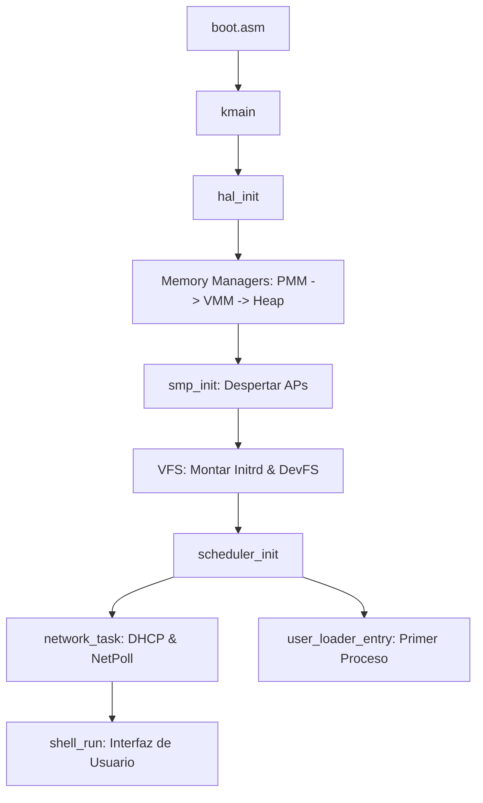

# 🩻 Radiografía Técnica: éterOS v0.2.0

**Estado General del Proyecto:** Estable (Fase de Integración de Subsistemas)
**Arquitectura:** Micro-Kernel Híbrido con Capa de Abstracción de Hardware (HAL)
**Target:** x86_64 (Modo Largo) con soporte SMP.

---

## 1. Arquitectura General
éterOS sigue un diseño modular donde el núcleo gestiona los recursos críticos y delega la funcionalidad específica a controladores y sistemas de archivos integrados.

### Mapa de Estructura (Directores Principales)
- `boot/`: Código de arranque en ensamblador (NASM) para x86_64.
- `kernel/`:
    - `arch/`: Implementaciones específicas de arquitectura (Context Switch, GDT, IDT, Syscalls).
    - `drivers/`: Controladores de hardware (Video, Input, Red e1000, PCI, RTC).
    - `fs/`: Capa VFS y drivers de sistemas de archivos (FAT32, JFS, DevFS, ProcFS, Initrd).
    - `mm/`: Gestión de memoria física (PMM), virtual (VMM) y dinámica (Heap).
    - `net/`: Stack de red (Custom y Port de lwIP).
    - `shell/`: Intérprete de comandos y aplicaciones integradas del núcleo.
- `userspace/`: Aplicaciones de usuario y biblioteca C mínima (`libc`).

---

## 2. Mapa de Funcionalidad

| Componente | Estado | Descripción |
| :--- | :--- | :--- |
| **PMM (Physical Memory)** | ✅ Completo | Bitmap de 4KB con estrategia Next-Fit y Word-Scanning (O(1) amortizado). |
| **VMM (Virtual Memory)** | ✅ Completo | Paginación de 4 niveles, Soporte CoW (Copy-on-Write) y TLB Shootdown. |
| **Scheduler** | ✅ Completo | Round-Robin Preemptivo con soporte para múltiples núcleos (SMP). |
| **VFS Abstraction** | ✅ Completo | Soporte para montajes dinámicos, enlaces simbólicos y normalización de rutas. |
| **Driver e1000** | ✅ Completo | Inicialización PCI, transmisión/recepción de tramas y gestión de descriptores. |
| **FAT32** | 🟡 Parcial | Implementado con soporte para archivos/directorios. Riesgo en fragmentación extrema. |
| **Network Stack** | 🟡 Parcial | Stack custom funcional (TCP/ARP/DHCP). El port de lwIP está incompleto. |
| **JFS (Journaling FS)** | 🟡 Parcial | Funciona como simulador en RAM Disk (4MB). Falta persistencia en disco real. |
| **SMP (Multicore)** | 🟡 Parcial | Despierta APs y gestiona colas de espera, pero falta afinidad de procesos. |
| **Syscalls POSIX** | 🔴 Esqueleto | Muchos syscalls (`poll`, `select`, `recvmsg`) son stubs que retornan `-ENOSYS`. |
| **DNS Client** | ⚪ Vacío | No existe resolución de nombres; se utilizan IPs estáticas o hardcoded. |

---

## 3. Flujo Principal de Comunicación
El sistema se inicializa siguiendo una cadena de dependencias estricta:

**Comunicación Inter-Componente:**
- **Drivers -> Kernel:** Vía Interrupciones y Colas de Espera (`sem_wait`).
- **Userspace -> Kernel:** Vía instrucción `syscall` (atrapada en `syscall_entry.asm`).
- **Núcleo -> CPUs:** Vía IPIs (Inter-Processor Interrupts) para TLB shootdown.

---

## 4. Dependencias y Entorno
- **Toolchain:** `x86_64-elf-gcc`, `nasm`, `x86_64-elf-ld`.
- **Librerías Externas:**
    - `lwIP 2.2.0`: Presente en código pero integración de sistema (`sys_arch.c`) mínima.
    - `ed25519`: Utilizada para verificación de firmas en actualizaciones OTA.
- **Entorno de Ejecución:** QEMU (x86_64) o VirtualBox (VDI). Requiere soporte VT-x/AMD-V.

---

## 5. Puntos Ciegos / Faltantes Críticos

1. **Resolución de Nombres (DNS):** El comando `ntp` y `ota` fallarán si el repositorio cambia de IP, ya que no hay lógica de cliente DNS en `kernel/net`.
2. **Persistencia de JFS:** El sistema posee un sistema de archivos con journaling (`jfs.c`), pero este opera sobre un buffer de RAM (`kmalloc`), perdiendo la integridad ante reinicios (contraproducente para un JFS).
3. **Gestión de Permisos Real:** Aunque existen campos `uid`/`gid` en los procesos, la lógica de `sys_faccessat` es permisiva y la shell no implementa un cambio de contexto de usuario real (`su`/`sudo`).
4. **Sincronización SMP en I/O:** El driver `e1000.c` y el acceso a disco carecen de bloqueos granulares por puerto/cola, lo que podría causar colisiones si múltiples CPUs intentan transmitir simultáneamente.

---
**Documento generado por el Arquitecto de Software para EterOS Project.**
